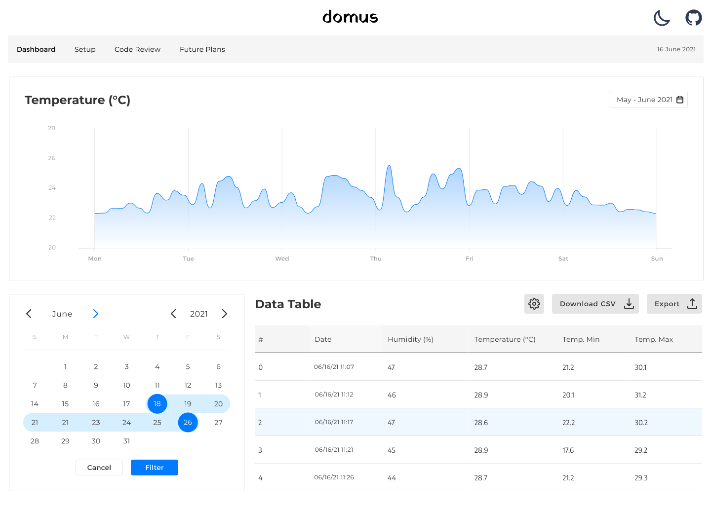

# domus

## What is it?
Domus is a web application that tracks my room's temperature and humidity throughout the day while comparing it to the data provided by the OpenWeatherMap API. 

## Technologies
* Dash (Python)
* Pandas
* Arduino C
* Sqlite

## Mockup

